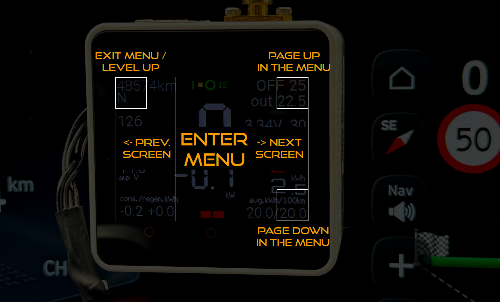
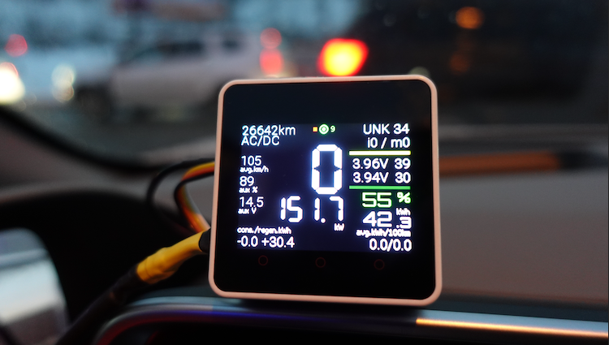

# evDash

evDash is an open-source EV dashboard for M5Stack devices. It reads live vehicle data from CAN/OBD2, shows real-time screens on a 320x240 touch display, and can log or upload telemetry over WiFi.

Use this firmware at your own risk.

- Discord: [Join the community](https://discord.gg/rfAvH7xzTr)
- Release notes: [RELEASENOTES.md](RELEASENOTES.md)
- Installation guide: [INSTALLATION.md](INSTALLATION.md)

## What evDash does

- live EV telemetry on multiple screens (tiles, speed, cells, charging graph, debug, HUD)
- touch-first UI with menu paging, drag scrolling, and on-screen keyboard
- communication via CAN (MCP2515/COMMU) or OBD2 BLE4
- OBD2 WiFi adapter mode (marked as DEV)
- SD card logging and optional remote uploads (ABRP, MQTT, API, anonymous contribute)
- OTA update over WiFi

## Supported hardware

### Main boards

- M5Stack Core2 v1.0
- M5Stack Core2 v1.1
- M5Stack CoreS3 (active development)

### Vehicle interface

- CAN via COMMU / MCP2515
- OBD2 BLE4 adapter (tested with Vgate iCar Pro BLE4)
- OBD2 WiFi adapter `[DEV]`

For long-term use, direct CAN is recommended over generic OBD2 adapters.

### GPS modules

- M5 GNSS (NEO-M9N, typically 38400 bps)
- M5 GPS (NEO-M8N, typically 9600 bps)

## Supported vehicles

This project is for battery EVs and EV/PHEV models with implemented decoders.

Fully supported:
- Hyundai Ioniq 5/6 (eGMP)
- Kia EV6 (eGMP)

Community/ongoing support:
- Kia e-Niro, e-Soul, EV9
- Hyundai Kona EV, Ioniq, Ioniq PHEV
- Renault Zoe
- BMW i3
- Peugeot e-208
- VW ID.3 / ID.4
- Audi Q4
- Skoda Enyaq

Support level varies by model year and ECU behavior. See [RELEASENOTES.md](RELEASENOTES.md) for the latest parser and feature updates.

## Quick install (binary)

Use the ESP Web Flasher from [INSTALLATION.md](INSTALLATION.md).

## Build from source (PlatformIO)

1. Install VS Code + PlatformIO extension.
2. Clone this repository.
3. Copy `platformio.ini.example` to `platformio.ini`.
4. Set your serial `upload_port` / `monitor_port`.
5. Build one target:

```bash
~/.platformio/penv/bin/pio run -e m5stack-core2-v1_0
~/.platformio/penv/bin/pio run -e m5stack-core2-v1_1
~/.platformio/penv/bin/pio run -e m5stack-cores3
```

6. Upload:

```bash
~/.platformio/penv/bin/pio run -e m5stack-core2-v1_0 -t upload
```

## UI controls

### Touch zones (normal screens)

- left third: previous screen
- right third: next screen
- center third: open menu

### Menu controls

- top-left `64x64`: exit/parent menu
- top-right `64x64`: page up
- bottom-right `64x64`: page down
- rest of area: select item
- drag: smooth vertical menu scroll



## Screens

- blank (LCD off)
- auto mode
- tiles/basic summary
- speed + driving/charging indicators
- battery cell voltages and temperatures
- charging graph
- debug / diagnostics
- HUD (when enabled)



## Anonymous contribute data

Enable `Remote Upload -> Contribute anon.data` to share anonymous command/response telemetry with the dev team.

Uploaded payload may include:
- ATSH + PID request identifiers
- raw response payloads
- timing fields like `<ATSH>_<PID>_ms`
- runtime state snapshot (SOC, temps, GPS, etc.)
- packet filter metadata when relevant

No direct personal identity fields are intended in this stream.

## M5Core2 v1.0 vs v1.1

Both run evDash. The key differences are power and RTC behavior.

| Topic | Core2 v1.0 | Core2 v1.1 |
|---|---|---|
| PMIC | AXP192 | AXP2101 |
| RTC backup battery | No | Yes |
| Onboard INA current sensing | No | Yes |
| Typical power LED color | Green | Blue |

v1.1 is usually better for long-running logging setups and stable timekeeping.

## No longer supported

- M5Stack Core1
- LILYGO TTGO T4 v1.3
- SIM800L GPRS module
